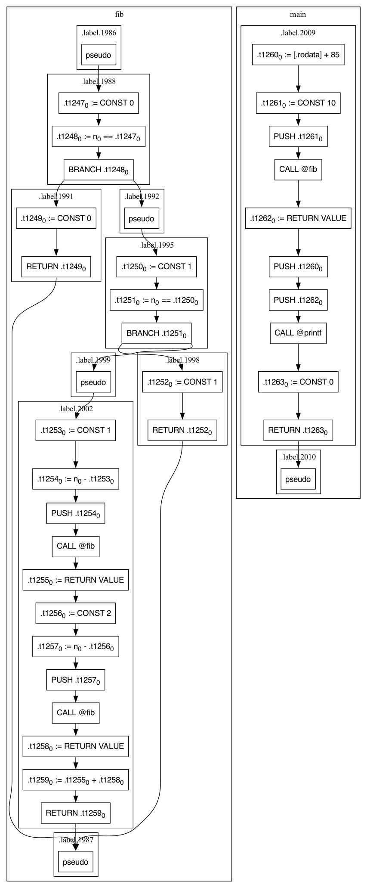

# shecc : self-hosting and educational C optimizing compiler

<p align="center"></p>

## Introduction

`shecc` is built from scratch, targeting 32-bit Arm, AArch64, 32-bit RISC-V,
and x86-64, as a self-compiling compiler for a subset of the C language.
Despite its simplistic nature, it is capable of performing basic optimization strategies as a standalone optimizing compiler.

### Features

* Generate executable Linux ELF binaries for ARMv7-A, AArch64, RV32IM, and x86-64.
* Provide a minimal C standard library for basic I/O on GNU/Linux.
* The cross-compiler is written in ANSI C, making it compatible with most platforms.
* Include a self-contained C front-end with an integrated machine code generator; no external assembler or linker needed.
* Utilize a two-pass compilation process: the first pass checks syntax and breaks down complex statements into basic operations,
  while the second pass translates these operations into target machine code.
* Develop a register allocation system that is compatible with RISC-style architectures.
* Implement an architecture-independent, [static single assignment](https://en.wikipedia.org/wiki/Static_single-assignment_form) (SSA)-based middle-end for enhanced optimizations.
* Support dynamic linking to allow generated executables to run with glibc.
* Emit both ELF32 (Arm, RISC-V) and ELF64 (AArch64, x86-64) images; the ELF class follows the target pointer width.

## Compatibility

`shecc` is capable of compiling C source files written in the following
syntax:
* data types: `char`, `short`, `int`, `_Bool`, `void`, `struct`, `union`, `enum`, `typedef`, and pointer types
* condition statements: `if`, `else`, `while`, `for`, `do-while`, `switch`, `case`, `default`, `break`, `continue`, `return`, `goto`
                        with labels, and general expressions
* operators: all arithmetic, logical, bitwise, and assignment operators including compound assignments
  (`+=`, `-=`, `*=`, `/=`, `%=`, `&=`, `|=`, `^=`, `<<=`, `>>=`)
* arrays: global/local arrays with initializers, multi-dimensional arrays
* functions: function declarations, definitions, and calls with fixed arguments
* variadic functions: basic support via direct pointer arithmetic (no `<stdarg.h>`)
* typedef: type aliasing including typedef pointers (`typedef int *ptr_t;`)
* pointers: full pointer arithmetic, multi-level pointer dereference (`***ptr`)
* global/local variable initializations for all supported data types
    - e.g. `int i = [expr];`, `int arr[] = {1, 2, 3};`
* preprocessor directives: `#define`, `#if`, `#ifdef`, `#ifndef`, `#elif`, `#else`, `#endif`, `#undef`, `#error`, and `#include`
* function-like macros with parameters, `__VA_ARGS__`, stringification (`#`), and token pasting (`##`)

The Arm backend targets armv7hf with the Linux ABI, verified on Raspberry Pi 3.
The AArch64 backend follows AAPCS64 and supports static and eager-bound dynamic
linking, verified with QEMU AArch64 on eMag. Its images separate the load
segments by 64 KiB so they load under any of the 4 KiB, 16 KiB and 64 KiB
translation granules AArch64 Linux may be configured with.
The RISC-V backend targets RV32IM, verified with QEMU.
The x86-64 backend follows the System V AMD64 ABI and runs natively on an
x86-64 GNU/Linux host, so no emulator is involved.

## Bootstrapping

The steps to validate `shecc` bootstrapping:
1. `stage0`: `shecc` source code is initially compiled using an ordinary compiler
   which generates a native executable. The generated compiler can be used as a
   cross-compiler.
2. `stage1`: The built binary reads its own source code as input and generates a
   binary for the selected target.
3. `stage2`: The generated target binary is invoked with its own source code as
   input and generates another target binary. It runs natively for x86-64 and on
   the Arm boards the build system recognizes; every other case, including the
   RISC-V target, goes through QEMU.
4. `bootstrap`: Build the `stage1` and `stage2` compilers, and verify that they are
   byte-wise identical. If so, `shecc` can compile its own source code and produce
   new versions of that same program.

## Prerequisites

Code generator in `shecc` does not rely on external utilities. You only need
ordinary C compilers such as `gcc` and `clang`. However, `shecc` would bootstrap
itself, so the target binaries have to run somewhere. Building for `x64` on an
x86-64 GNU/Linux host needs nothing extra. Building for Arm or RISC-V on such a
host requires ISA emulation; install QEMU for Arm/RISC-V user emulation:

```shell
$ sudo apt-get install qemu-user
```

The build system is able to verify whether the running machine can perform native
execution without QEMU. The host machine may install the prebuilt
[fastfetch](https://github.com/fastfetch-cli/fastfetch/), which allows the build
system to determine whether native execution can be enabled.

It is still possible to build `shecc` on macOS or Microsoft Windows. However,
the second stage bootstrapping would fail due to `qemu-arm` absence, and the
`x64` target expects an x86-64 GNU/Linux host to execute its own output.

### Additional packages

The dynamic linking mode needs an ELF interpreter and the matching glibc for the
target. The `x64` target resolves both from the host system, so it needs nothing
beyond an x86-64 GNU/Linux installation. The Arm, AArch64, and RISC-V targets need a
cross-compile GNU toolchain to obtain them.

For the Arm architecture, you can install the ARM GNU toolchain using `apt-get`:

```shell
$ sudo apt-get install gcc-arm-linux-gnueabihf
```
Another approach is to manually download and install the toolchain from [ARM Developer website](https://developer.arm.com/downloads/-/arm-gnu-toolchain-downloads).
Select "x86_64 Linux hosted cross toolchains" - "AArch32 GNU/Linux target with hard float (arm-none-linux-gnueabihf)"
to download the toolchain.

For AArch64 dynamic binaries, install the matching toolchain and user emulator:

```shell
$ sudo apt-get install gcc-aarch64-linux-gnu qemu-user
```

Since `apt-get` does not provide the necessary RISC-V GNU toolchain, it must be downloaded manually if you want to
run a dynamically linked `shecc` targeting the RISC-V architecture. For instance, you can download and extract the
`riscv32-glibc-ubuntu-22.04-gcc.tar.xz` package from the [riscv-gnu-gcc](https://github.com/riscv-collab/riscv-gnu-toolchain) repository.

## Build and Verify

Configure which backend you want. `shecc` supports the ARMv7-A, AArch64,
RV32IM, and x86-64 backends, with Arm as the default:
```shell
$ make config ARCH=arm
# Target machine code switch to arm

$ make config ARCH=riscv
# Target machine code switch to riscv

$ make config ARCH=arm64
# Target machine code switch to arm64

$ make config ARCH=x64
# Target machine code switch to x64
```

The selected target is recorded in the tree, so a later `make` with a different
`ARCH` stops and asks for an explicit `make config ARCH=...` rather than pairing
one target's settings with another target's generated configuration.

Run `make` and you should see this:
```shell
$ make
  CC+LD	out/inliner
  GEN	out/libc.inc
  CC	out/src/main.o
  LD	out/shecc
  SHECC	out/shecc-stage1.elf
  SHECC	out/shecc-stage2.elf
```

Run `make DYNLINK=1` to use the dynamic linking mode and generate the dynamically linked compiler:
```shell
# If using the dynamic linking mode, you should add 'DYNLINK=1' for each 'make' command.
# The target architecture comes from the last 'make config' (default: arm).
$ make DYNLINK=1
  CC+LD	out/inliner
  GEN	out/libc.inc
  CC	out/src/main.o
  LD	out/shecc
  SHECC	out/shecc-stage1.elf
  SHECC	out/shecc-stage2.elf

$ file out/shecc-stage2.elf
# ARCH=arm:
out/shecc-stage2.elf: ELF 32-bit LSB executable, ARM, EABI5 version 1 (SYSV), dynamically linked, interpreter /lib/ld-linux-armhf.so.3, not stripped
# ARCH=arm64:
out/shecc-stage2.elf: ELF 64-bit LSB executable, ARM aarch64, dynamically linked, interpreter /lib/ld-linux-aarch64.so.1, no section header
```

For development builds with memory safety checks:
```shell
$ make sanitizer
$ make check-sanitizer
```

File `out/shecc` is the first stage compiler. Its usage:
```shell
$ shecc [-o output] [+m] [--dot] [--no-libc] [--dump-ir] [--dynlink] [-E] <infile.c>
```

Compiler options:
- `-o` : Specify output file name (default: `out.elf`)
- `+m` : Use hardware multiplication/division instructions (default: disabled)
- `--dot` : Write the SSA control-flow graph in Graphviz DOT format and stop
- `--no-libc` : Exclude embedded C library (default: embedded)
- `--dump-ir` : Dump intermediate representation (IR)
- `--dynlink` : Use dynamic linking (default: disabled)
- `-E` : Preprocess only; write the expanded token stream and stop

Example 1: static linking mode
```shell
$ out/shecc -o fib tests/fib.c
$ qemu-arm fib
```

The compiler marks its own output executable, so neither example needs a
`chmod +x` in front of the run. Earlier revisions did: the mode used to be
whatever the libc that opened the file chose, which was 0666 for a
glibc-linked build.

An `x64` build produces a native binary, so `./fib` runs it directly with no
emulator in front.

Example 2: dynamic linking mode

For AArch64, `/usr/aarch64-linux-gnu` is a typical ELF interpreter prefix.
The path may differ if you manually install a GNU toolchain, so set it to the
actual sysroot.
```shell
$ out/shecc --dynlink -o fib tests/fib.c
$ qemu-arm -L /usr/arm-linux-gnueabihf fib      # ARCH=arm
$ qemu-aarch64 -L /usr/aarch64-linux-gnu fib    # ARCH=arm64
```

### Unit Tests

`shecc` has one behavioral test flow. `make check` runs the executable and
compiler-error tests with both the host-built and self-hosted compilers, then
runs the selected target's ABI tests. To run it:
```shell
# Add 'DYNLINK=1' if using the dynamic linking mode.
$ make check          # Consolidated suite: stage 0, stage 2, and ABI tests
$ make check-stage0   # Test stage 0 compiler only
$ make check-stage2   # Test stage 2 compiler only
$ make check-abi-stage0 # Check the target calling convention (stage 0)
$ make check-abi-stage2 # Same, for the stage 2 compiler
$ make check-sanitizer # Test with AddressSanitizer and UBSan
```

The test suite covers:
* Basic data types and operators
* Control flow statements
* Arrays and pointers (including multi-level dereference)
* Structs, enums, and typedefs
* Variadic functions
* Preprocessor directives and macros
* Calling convention conformance for the selected target
* Self-hosting validation

Reference output (Arm target; pointer sizes read 8 on x86-64):
```
  TEST STAGE 0
...
int main(int argc, int argv) { exit(sizeof(char)); } => 1
int main(int argc, int argv) { int a; a = 0; switch (3) { case 0: return 2; case 3: a = 10; break; case 1: return 0; } exit(a); } => 10
int main(int argc, int argv) { int a; a = 0; switch (3) { case 0: return 2; default: a = 10; break; } exit(a); } => 10
OK
  TEST STAGE 2
...
int main(int argc, int argv) { exit(sizeof(char*)); }
exit code => 4
output => 
int main(int argc, int argv) { exit(sizeof(int*)); }
exit code => 4
output => 
OK
```

To clean up the generated compiler files, execute the command `make clean`.
For resetting architecture configurations, use the command `make distclean`.

## Intermediate Representation

The middle end is SSA-based, and two options expose it. `--dot` draws the
control-flow graph as it stands after SSA construction and pruning; `--dump-ir`
prints the instructions as text, once before optimization and once after
register allocation. Both use `tests/fib.c` below as the running example, a
recursive Fibonacci function and its caller:

```c
#include <stdio.h>

int fib(int n)
{
    if (n == 0)
        return 0;
    else if (n == 1)
        return 1;
    return fib(n - 1) + fib(n - 2);
}

int main()
{
    printf("F(10) = %d\n", fib(10));
    return 0;
}
```

### Control-flow graph

`--dot` writes Graphviz DOT and stops; no executable is generated. Without
`-o`, the name is the input path with its final suffix replaced, or `.dot`
appended when it has none, so `tests/fib.c` would write `tests/fib.dot` into the
source tree.

```shell
$ out/shecc --dot -o fib.dot tests/fib.c
$ dot -Tsvg fib.dot -o fib.svg
```

Graphviz renders the result but is not needed to produce it, and nothing in
`make check` depends on it.

The output holds one cluster per function definition, one nested cluster per
basic block,
and one node per IR instruction; a block holding no instruction gets a single
placeholder node labeled `pseudo`. Edges inside a block are instruction order,
and the edges leaving a block's last node are control flow. The graph is emitted
before phi values are unwound into edge copies, so the phi nodes are still in
it, and functions the input cannot reach are pruned first. That pruning is what
keeps the picture readable: with the embedded C library prepended, `fib.c` gives
48 function bodies, of which 22 are reachable. The 20 that are neither `fib` nor
`main` are what `printf` drags in transitively, down to `malloc` and `abort`.

The figure below is the `fib` and `main` clusters of that output, with the
run-specific pointer values dropped from the labels. Those two are the last
clusters emitted, so keeping everything from `fib` to the end of the file is
exactly the input's own code; that is what makes the crude recipe below work,
not a general way to slice one function out:

```shell
$ { echo 'strict digraph CFG {'; echo 'node [shape=box]'
    awk '/\(fib\)"$/ { keep = 1; print prev } keep; { prev = $0 }' fib.dot; } |
  sed -E 's/"(BasicBlock )?0x[0-9a-f]+ \((.+)\)"/"\2"/' > fib-fn.dot
$ dot -Tpng -Granksep=0.3 -Nfontname=Helvetica fib-fn.dot -o docs/fib-cfg.png
```



Reading `fib` from the top:

* `.label.1986` and `.label.1987` carry no instructions. Every function gets a
  dedicated entry block and a single exit block; the entry block is empty only
  when the body opens with a control-flow construct, as `fib` does with its
  `if`, while `main` starts straight into instructions. All three `RETURN`s edge
  into the exit, so the graph stays single-entry and single-exit no matter how
  many `return` statements the C code spells out.
* `.label.1988` is the `n == 0` test: materialize the constant, compare, then
  `BRANCH`. The true edge leaves the bottom-left corner of a `BRANCH` node and
  the false edge the bottom-right; where the two targets land is up to Graphviz,
  so the edges cross whenever it places them the other way around.
* `.label.1991` is `return 0`. `.label.1992` is the else arm, an empty block
  that falls into `.label.1995`, the `n == 1` test. Those empty blocks are
  branch targets the parser reserved before it knew what the arm would contain.
* `.label.1998` is `return 1`, and `.label.1999` falls into `.label.2002`, the
  recursive tail.
* Each call in `.label.2002` is a `PUSH` per argument, a `CALL`, and a
  `RETURN VALUE` naming the result. Argument passing stays explicit in the IR,
  so the register allocator, not the front end, decides which registers carry
  them.

Subscripts in the figure are SSA versions: `n₀` is the incoming parameter,
`.t1247₀` the first definition of the temporary `.t1247`. `fib` needs no phi,
because control flow never merges after a write here; every value is defined
once on the path that reaches its use. A phi appears where it does merge. In the
same graph, `strlen` carries `i₂ := PHI(i₁, i₃)` at its loop header, one argument
per incoming edge: `i₁` from the block ahead of the loop, `i₃` from the back edge.

Temporary and label numbers shift whenever `lib/c.c` changes. Read them as
identity within one dump, not as stable names.

### Instruction dump

```shell
$ out/shecc --dump-ir -o fib tests/fib.c
```

The first dump, delimited by `==<START OF INSN DUMP>==` and
`==<END OF INSN DUMP>==`, is the IR before optimization, walked in
dominator-tree order. Three things have already happened to it: small callees
are inlined into their callers, the phis are unwound into copies, and the
printer then elides those copies along with the SSA subscripts, so `--dot` is
the only view that shows either. Pruning has not run yet, so every function with
a body is listed, libc included. Line by line against the C source:

```
C source              IR                                      Notes
---------------------+---------------------------------------+---------------------------------
int fib(int n)        def int @fib(int %n) {                  %n parameter, %.tN temporary
{
  if (n == 0)           const %.t1247, 0
                        %.t1248 = eq %n, %.t1247
                        br %.t1248, .label.1991, .label.1992  true target first, false second
    return 0;         .label.1991:
                        const %.t1249, 0
                        ret %.t1249
  else if (n == 1)    .label.1995:                            reached via empty .label.1992
                        const %.t1250, 1
                        %.t1251 = eq %n, %.t1250
                        br %.t1251, .label.1998, .label.1999
    return 1;         .label.1998:
                        const %.t1252, 1
                        ret %.t1252
  return fib(n - 1)   .label.2002:
                        const %.t1253, 1
                        %.t1254 = sub %n, %.t1253
                        push %.t1254                          one push per argument
                        call @fib
                        retval %.t1255                        names the callee's result
       + fib(n - 2);    const %.t1256, 2
                        %.t1257 = sub %n, %.t1256
                        push %.t1257
                        call @fib
                        retval %.t1258
                        %.t1259 = add %.t1255, %.t1258
                        ret %.t1259
}                     }
```

A block earns a label line only by holding instructions, and the first one that
qualifies is folded into the function header. That is why neither `.label.1992`,
an empty block the graph shows, nor `.label.1988`, which holds the first three
instructions, appears as a label here. The graph is the better view of control
flow; this dump is the better view of what each block computes.

The second dump follows register allocation, the peephole pass, the
architecture-specific lowering, and the flattening of the CFG into a linear
list. It is the last IR before machine code:

```
fib:
	store %x0, 16(sp)
	li %x1, $0
	%x2 = eq %x0, %x1
	br %x2
	...
	li %x1, $2
	load %x2, 16(sp)
	%x2 = sub %x2, %x1
	store %x0, 24(sp)
	%x0 = %x2
	call @fib
```

The listing above is the default Arm configuration; the register numbers follow
whatever target `make config` selected. `%xN` are post-allocation register
slots rather than SSA values, and how many exist and which hardware register
each maps to is the backend's business. `16(sp)` is a stack slot: `n` is spilled
on entry because it stays live across both calls, and the first call's result is
spilled in turn while the second one runs. `br` prints only its condition, but
both targets are still on the instruction; the backend encodes the true one as an
offset and lets the false one fall through when it is the next block in the
list.

## C99 Compliance

shecc implements a subset of C99 suitable for self-hosting and systems programming.
For detailed information about supported features, missing functionality, and non-standard behaviors,
see [COMPLIANCE.md](COMPLIANCE.md).

## Known Issues

1. Full `<stdarg.h>` support is not available. Variadic functions work via direct pointer arithmetic.
   See the `printf` implementation in `lib/c.c` for the supported approach.
2. The C front-end operates directly on token streams without building a full AST.
3. Complex pointer arithmetic expressions like `*(p + offset)` have limited support.

## License

`shecc` is freely redistributable under the BSD 2 clause license.
Use of this source code is governed by a BSD-style license that can be found in the `LICENSE` file.
